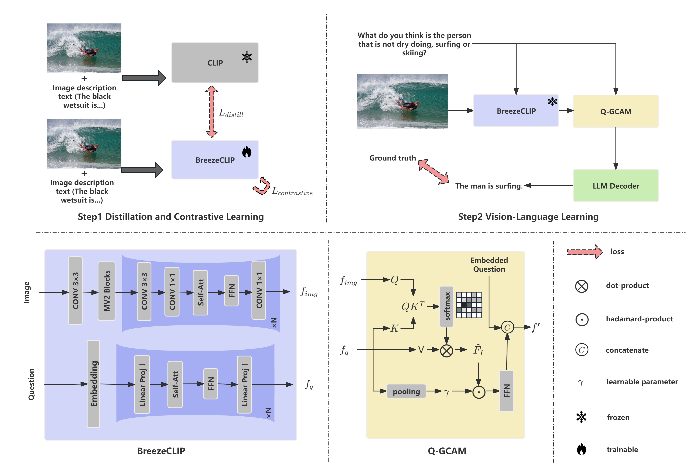

# BcQLM: Efficient Vision-Language Understanding with Distilled Q-Gated Cross-Modal Fusion

## Abstract
As multimodal large language models (MLLMs) advance, their large-scale architectures pose challenges for deployment in resource-constrained environments. In the age of large models, where energy efficiency, computational scalability, and environmental sustainability are paramount, the development of lightweight and high-performance models is critical for real-world applications. As such, we propose a lightweight MLLM framework for end-to-end visual question answering. Our proposed approach centres on BreezeCLIP, a compact yet powerful vision-language encoder optimised for efficient multimodal understanding. With only 1.2 billion parameters overall, our model significantly reduces computational cost while achieving performance comparable to standard-size MLLMs. Experiments conducted on multiple datasets further validate its effectiveness in balancing accuracy and efficiency. The modular and extensible design enables generalisation to broader multimodal tasks. The proposed lightweight vision-language framework is denoted as BcQLM (BreezeCLIP-enhanced Q-Gated Multimodal Language Model). It offers a promising path toward deployable MLLMs under practical hardware constraints.

##  Model Overview
<p align="center">
  
</p>


## Citation

If you find our work useful, please consider citing:

```bibtex
@misc{xiang2025bcqlm,
  title={BcQLM: Efficient Vision-Language Understanding with Distilled Q-Gated Cross-Modal Fusion},
  author={Xiang, Sike and Chen, Shuang and Atapour-Abarghouei, Amir},
  year={2025},
  eprint={2509.08715},
  archivePrefix={arXiv},
  primaryClass={cs.CV},
  url={https://arxiv.org/abs/2509.08715}
}

@inproceedings{xiang-etal-2025-bcqlm,
    title = "{B}c{QLM}: Efficient Vision-Language Understanding with Distilled {Q}-Gated Cross-Modal Fusion",
    author = "Xiang, Sike  and
      Chen, Shuang  and
      Atapour-Abarghouei, Amir",
    editor = "Christodoulopoulos, Christos  and
      Chakraborty, Tanmoy  and
      Rose, Carolyn  and
      Peng, Violet",
    booktitle = "Findings of the Association for Computational Linguistics: EMNLP 2025",
    month = nov,
    year = "2025",
    address = "Suzhou, China",
    publisher = "Association for Computational Linguistics",
    url = "https://aclanthology.org/2025.findings-emnlp.780/",
    doi = "10.18653/v1/2025.findings-emnlp.780",
    pages = "14462--14472",
    ISBN = "979-8-89176-335-7",
    abstract = "As multimodal large language models (MLLMs) advance, their large-scale architectures pose challenges for deployment in resource-constrained environments. In the age of large models, where energy efficiency, computational scalability and environmental sustainability are paramount, the development of lightweight and high-performance models is critical for real-world applications. As such, we propose a lightweight MLLM framework for end-to-end visual question answering. Our proposed approach centres on BreezeCLIP, a compact yet powerful vision-language encoder optimised for efficient multimodal understanding. With only 1.2 billion parameters overall, our model significantly reduces computational cost while achieving performance comparable to standard-size MLLMs. Experiments conducted on multiple datasets further validate its effectiveness in balancing accuracy and efficiency. The modular and extensible design enables generalisation to broader multimodal tasks. The proposed lightweight vision-language framework is denoted as BcQLM (BreezeCLIP-enhanced Q-Gated Multimodal Language Model). It offers a promising path toward deployable MLLMs under practical hardware constraints. The source code is available at \url{https://github.com/thico0224/BcQLM}."
}
